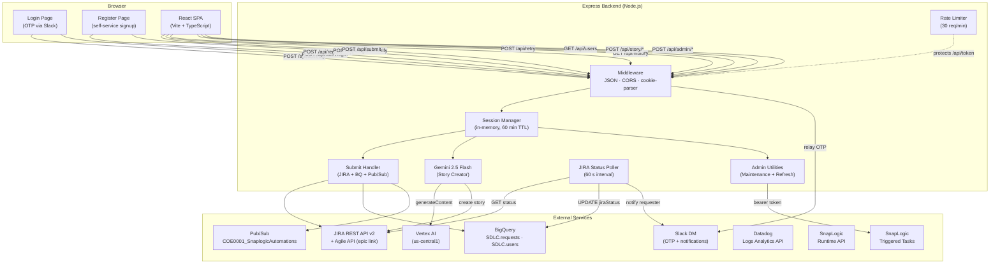
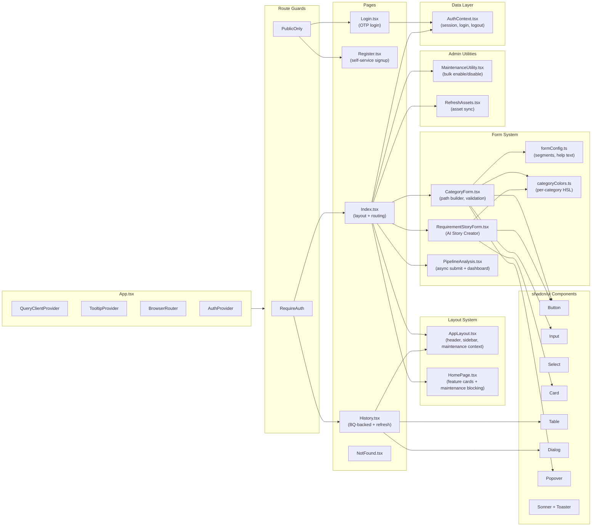

# SnapLogic Request Portal (Local Development)

An internal web application for Palo Alto Networks that enables team members to submit SnapLogic pipeline operation requests through a form-based UI. The backend creates a JIRA ticket, records the request in BigQuery, and publishes a Pub/Sub message that triggers downstream automation pipelines.

---

## Project Structure

```
snaplogicautomations/
├── README.md                          # This file (local development)
├── linkedin-post-snaplogic.html       # Project documentation page
├── Analysis/                          # Analysis artifacts
│
├── backend/
│   ├── server.js                      # Express server (JIRA, BigQuery, Pub/Sub, Gemini, OTP)
│   └── package.json                   # Backend dependencies
│
├── frontend/
│   ├── package.json                   # Frontend dependencies & scripts
│   ├── index.html                     # SPA entry HTML
│   ├── vite.config.ts                 # Vite build config (proxy /api → localhost:3000)
│   ├── vitest.config.ts               # Test runner config
│   ├── tailwind.config.ts             # Tailwind theme + custom colors
│   ├── postcss.config.js              # PostCSS plugins
│   ├── eslint.config.js               # ESLint flat config
│   ├── tsconfig.json                  # TypeScript project references
│   ├── components.json                # shadcn/ui config
│   │
│   └── src/
│       ├── main.tsx                   # React entry point
│       ├── App.tsx                    # Root component (AuthProvider, routing, guards)
│       ├── index.css                  # Global styles + Tailwind theme variables
│       │
│       ├── pages/
│       │   ├── Login.tsx              # OTP-based login page (Slack delivery)
│       │   ├── Register.tsx           # Self-service registration (name + email + OTP verify)
│       │   ├── Index.tsx              # Main page with AppLayout + content switching
│       │   ├── History.tsx            # BigQuery-backed request history (paginated, filterable)
│       │   ├── PipelineAnalysis.tsx   # Pipeline Performance Analysis (submit/view/dashboard)
│       │   └── NotFound.tsx           # 404 page
│       │
│       ├── components/
│       │   ├── AppLayout.tsx          # Shared layout (header, collapsible sidebar, maintenance context, content area)
│       │   ├── HomePage.tsx           # Welcome page with feature card grid
│       │   ├── CategoryForm.tsx       # Dynamic form renderer (path builder, validation, submit)
│       │   ├── RequirementStoryForm.tsx # AI Story Creator (Gemini preview + JIRA create)
│       │   ├── MaintenanceUtility.tsx # Admin-only bulk enable/disable production tasks
│       │   ├── RefreshAssets.tsx      # Admin-only asset sync utility
│       │   ├── NavLink.tsx            # Styled NavLink wrapper
│       │   └── ui/                    # ~48 shadcn/ui components
│       │
│       ├── lib/
│       │   ├── AuthContext.tsx        # React context for session auth (login, logout, sendOtp)
│       │   ├── config.ts             # BASE_PATH helper for sub-path API calls
│       │   ├── categoryColors.ts     # Per-category color definitions (HSL + accent)
│       │   ├── formConfig.ts         # Category & field definitions (path segments, help text)
│       │   └── utils.ts              # cn() Tailwind merge utility
│       │
│       ├── hooks/
│       │   ├── use-toast.ts          # Toast state management hook
│       │   └── use-mobile.tsx        # Mobile breakpoint detection hook
│       │
│       └── test/
│           ├── setup.ts              # Test setup (jest-dom + matchMedia mock)
│           └── example.test.ts       # Placeholder test
│
└── snaplogic-automations-backend/     # Deploy version (separate README)
```

---

## Features

### UI & Layout
- **Modern responsive layout** -- Fixed header with logo, user actions, and sign-out; collapsible left sidebar with categorized navigation (Forms + Utilities); main content area for forms and utilities; responsive across mobile, tablet, and desktop
- **Responsive three-tier layout** -- Mobile (<768px): hamburger menu with overlay sidebar; Tablet (768–1023px): collapsed icon-only sidebar; Desktop (≥1024px): fully expanded sidebar with labels. Auto-adapts on window resize
- **Home page with feature cards** -- Welcome page showing all available forms and utilities as clickable cards; admin-only cards (Maintenance Utility, Refresh Assets) hidden from non-admin users
- **Maintenance mode enforcement** -- When maintenance is active (global or per-category), affected forms are grayed out and unclickable in both the sidebar and the home page cards. An "Under maintenance" label appears on blocked cards. Utility pages (Pipeline Analysis, Refresh Assets, Maintenance Utility) remain accessible. State exposed via React Context (`useMaintenance()` hook)
- **Per-category color theming** -- Each category has a unique accent color applied to sidebar icons, home page cards, badges, submit buttons, and form focus rings

### Request Categories
- **Multi-category request submission** -- Eight request types: Migration, Comparison, Review, Confluence Documentation, Naming Convention, Unit Testing, New Logging, and AI Story Creator
- **AI-powered Story Creator** -- Free-text requirements are converted into structured JIRA stories using Google Gemini 2.5 Flash (Vertex AI); preview before creating, with auto-generated summary, description (JIRA wiki markup), labels, and story points; includes automatic retry with exponential backoff (3 attempts) and Google Auth warmup on server start for cold-start resilience
- **Data-driven dynamic forms** -- All form configurations are defined in a single config file; adding a new category requires zero component changes
- **Structured path builder** -- Paths are assembled from dropdown-selected SnapLogic ORG + free-text project space / project / pipeline segments instead of raw text input
- **JIRA key format validation** -- All form categories validate that JIRA references match `SNAPLOGIC-NNN` format (not full URLs)
- **Contextual help popovers** -- Confluence Page ID and Version fields include step-by-step help text accessible via an info icon

### Utilities (Admin-Only)
- **Pipeline Performance Analysis** -- Submits asynchronous analysis jobs that discover pipelines from Datadog, fetch execution details from SnapLogic Runtime API, compute per-execution KPIs (SLA compliance, stability score, throughput, bottleneck classification, severity tiers), store results in BigQuery, and present an interactive multi-tab dashboard with aggregate summaries, engineering metrics, infrastructure health, and per-execution drill-down. Supports runtime filtering (Cloud vs Groundplex), ETA tracking, Excel export, and Slack/JIRA notifications on completion. "All Pipelines" analysis mode is admin-only.
- **Maintenance Utility** -- Admin-only bulk enable/disable for all scheduled production tasks via SnapLogic triggered tasks. Two-button interface (Disable All / Enable All) with confirmation feedback and detailed error reporting. Activating maintenance mode disables form access globally or per-category across sidebar and home page cards via React Context
- **Refresh Assets** -- Admin-only utility to sync project spaces, projects, and pipelines from SnapLogic to BigQuery asset cache. Supports org selection (Dev, QA, UAT, Prod) with bearer-token authenticated triggered task calls

### Authentication & Authorization
- **Self-service registration** -- New users can sign up with their `@paloaltonetworks.com` email; OTP-verified, then inserted into BigQuery `SDLC.users`; duplicate emails are rejected with a redirect to login
- **Session-based authentication** -- OTP login flow via Slack DM; httpOnly cookie-based sessions with 60-minute TTL and automatic cleanup
- **OTP via Slack** -- OTP is generated server-side (6-digit, 5-minute expiry), relayed through SnapLogic to Slack DM; split-input UI with paste support, cooldown timer (60 s), and expiry handling
- **Admin role enforcement** -- Admin-only features (Maintenance Utility, Refresh Assets, All Pipelines analysis, Prod migration) are enforced both in the UI (conditional rendering) and server-side (403 responses)
- **Prod migration authorization** -- Only admin users (`isAdmin`) can migrate pipelines to the `PaloAltoNetworks-Prod` environment; enforced server-side

### Backend & Integrations
- **JIRA ticket creation** -- Creates JIRA tickets directly via REST API (supports both Data Center PAT and Cloud API token auth)
- **Epic linking** -- Created tickets are linked to the configured epic via the JIRA Agile API; `coe` component is added via a separate PUT call
- **JIRA status polling** -- Background job (60 s interval) syncs live JIRA status into BigQuery; sends Slack notifications to the requester when tickets reach terminal states (Reviewed, Done, Blocked)
- **Request retry** -- Users can re-submit a previously failed request with a reason; re-publishes to Pub/Sub, adds a JIRA comment, updates BQ (`retried`, `retryReason`), and alerts admins via Slack. Retry is disabled for Pipeline Analysis requests.
- **BigQuery integration** -- Inserts request records into `SDLC.requests` (via parameterized DML) and fetches user list from `SDLC.users`
- **Paginated server-side history** -- Request history is fetched from BigQuery with `page`/`pageSize` support, scoped to the authenticated user's email; includes debounced search bar (LIKE across 7 columns) and Category/Status dropdown filters — all server-side. In-page refresh button re-fetches data without a full page reload
- **Pub/Sub event publishing** -- Each submission publishes to the `COE0001_SnaplogicAutomations` topic with an `action` attribute for downstream routing
- **Admin Slack alerts** -- When review/naming/unit-testing targets a non-Dev org, admin users are notified via Slack DM
- **Triggered task integration** -- Maintenance Utility and Refresh Assets use bearer-token authenticated calls to SnapLogic triggered tasks (tokens stored in environment variables)

---

## Tech Stack

| Layer         | Technologies                                                                                    |
| ------------- | ----------------------------------------------------------------------------------------------- |
| **Frontend**  | React 18, TypeScript, Vite 7, Tailwind CSS, shadcn/ui (Radix UI), React Router v6, TanStack React Query, Zod, Sonner, Lucide React, date-fns, Recharts |
| **Backend**   | Node.js, Express 4, compression, cookie-parser, undici 8, google-auth-library, @google-cloud/pubsub, crypto, dotenv, CORS, express-rate-limit, xlsx |
| **AI/LLM**    | Google Gemini 2.5 Flash via Vertex AI (`us-central1`) -- requirement-to-JIRA-story conversion   |
| **GCP**       | BigQuery (`SDLC.requests`, `SDLC.users`, `SDLC.pipeline_analysis`, `SDLC.pipeline_analysis_pipelines`, `SDLC.pipeline_analysis_executions`), Pub/Sub (`COE0001_SnaplogicAutomations`), Vertex AI   |
| **External**  | JIRA REST API v2, SnapLogic Triggered Tasks (bearer-token auth), SnapLogic Runtime API, Datadog Logs Analytics API, Slack (via SnapLogic relay) |
| **Build**     | Vite, ESBuild, PostCSS, Autoprefixer                                                            |
| **Testing**   | Vitest, @testing-library/react, jsdom                                                            |

---

## Request Categories

| Category              | Action         | Path Type           | Key Fields                                                     |
| --------------------- | -------------- | ------------------- | -------------------------------------------------------------- |
| **Migration**         | Migration      | ORG/Space/Project/  | Path, Target Env, Target Path, Changes Related To, Pipelines, JIRA |
| **Comparison**        | Compare        | ORG/Space/Project/  | Path, Target Env, Target Path, Pipelines, JIRA                 |
| **Review**            | Review         | ORG/Space/Proj/Pipe | Path, Prod Deployment Date, Naming, Unit Test Cases, JIRA      |
| **Confluence**        | Confluence     | ORG/Space/Proj/Pipe | Path, Confluence Page ID (with help), Version (with help), JIRA |
| **Naming Convention** | Document       | ORG/Space/Proj/Pipe | Path, JIRA                                                     |
| **Unit Testing**      | UnitTesting    | ORG/Space/Proj/Pipe | Path, Prod Deployment Date, JIRA                               |
| **New Logging**       | NewLogging     | ORG/Space/Proj/Pipe | Path, JIRA                                                     |
| **Story Creator**     | _(AI-generated)_ | _(N/A)_           | Free-text requirement → Gemini generates summary, description, labels, story points |

Name and Email fields are no longer on the form -- they come from the authenticated session.

---

## Prerequisites

- **Node.js** (v18 or later) and **npm**
- A `.env` file in `backend/` with the required environment variables (see below)
- GCP service account credentials (for BigQuery, Pub/Sub, and Vertex AI)

---

## Environment Variables

Create a `.env` file in the `backend/` directory with the following variables:

### Core

| Variable                          | Description                                                           |
| --------------------------------- | --------------------------------------------------------------------- |
| `PORT`                            | Server port (defaults to `3000` locally)                              |

### JIRA

| Variable            | Description                                                    |
| ------------------- | -------------------------------------------------------------- |
| `JIRA_BASE_URL`     | e.g. `https://jira.yourcompany.com`                            |
| `JIRA_PROJECT_KEY`  | e.g. `SNAPLOGIC`                                               |
| `JIRA_API_TOKEN`    | PAT (Data Center) or API token (Cloud)                         |
| `JIRA_EMAIL`        | Only required for Atlassian Cloud (Basic auth)                 |
| `JIRA_TYPE`         | `"dc"` (default) or `"cloud"`                                  |
| `JIRA_EPIC`         | Epic link key (populates `customfield_10008`); optional        |

### GCP

| Variable                         | Description                                              |
| -------------------------------- | -------------------------------------------------------- |
| `GCP_PROJECT_ID`                 | Defaults to `itp-iad-snaplogic-int`; used for BigQuery, Pub/Sub, and Vertex AI |
| `GOOGLE_APPLICATION_CREDENTIALS` | Path to GCP service account key file (requires BigQuery, Pub/Sub, and `cloud-platform` scopes) |

### Pipeline Analysis

| Variable                         | Description                                              |
| -------------------------------- | -------------------------------------------------------- |
| `DD_API_KEY`                     | Datadog API key (for pipeline discovery via Logs Analytics) |
| `DD_APP_KEY`                     | Datadog Application key                                  |
| `SNAPLOGIC_RUNTIME_BASIC_AUTH`   | Base64-encoded credentials for SnapLogic Runtime API     |

### Triggered Tasks (Admin Utilities)

| Variable                         | Description                                              |
| -------------------------------- | -------------------------------------------------------- |
| `SYNCPROJECTSTOBQ`               | Bearer token for the Refresh Assets triggered task (syncs projects to BigQuery) |
| `DISABLETASKS`                   | Bearer token for the Maintenance Utility disable triggered task |
| `ENABLETASKS`                    | Bearer token for the Maintenance Utility enable triggered task |

---

## Getting Started

### 1. Install dependencies

```sh
# Backend
cd backend
npm install

# Frontend
cd ../frontend
npm install
```

### 2. Run in development mode

Start the backend and frontend in separate terminals:

```sh
# Terminal 1 -- Backend (port 3000)
cd backend
node server.js

# Terminal 2 -- Frontend (port 8080, proxies /api to backend via vite.config.ts)
cd frontend
npm run dev
```

The frontend Vite dev server proxies all `/api` requests to the backend at `localhost:3000`.

### 3. Build frontend for local testing

```sh
cd frontend
npm run build
```

The built files are output to `dist/` at the project root.

---

## Available Scripts

### Backend (`backend/`)

| Script      | Command           | Description            |
| ----------- | ----------------- | ---------------------- |
| `start`     | `node server.js`  | Start the Express server |

### Frontend (`frontend/`)

| Script       | Command                       | Description                     |
| ------------ | ----------------------------- | ------------------------------- |
| `dev`        | `vite`                        | Start dev server (port 8080)    |
| `build`      | `vite build`                  | Production build                |
| `build:dev`  | `vite build --mode development` | Development build             |
| `preview`    | `vite preview`                | Preview production build        |
| `lint`       | `eslint .`                    | Run ESLint                      |
| `test`       | `vitest run`                  | Run tests once                  |
| `test:watch` | `vitest`                      | Run tests in watch mode         |

---

## API Endpoints

### Public (no session required)

| Method | Endpoint            | Description                                       |
| ------ | ------------------- | ------------------------------------------------- |
| GET    | `/api/users`        | Returns the user list from BigQuery `SDLC.users` (cached 5 min) |
| POST   | `/api/auth/otp`     | Sends a login OTP to the user's Slack DM           |
| POST   | `/api/auth/login`   | Validates OTP and creates an httpOnly session cookie |
| POST   | `/api/auth/logout`  | Destroys the session and clears the cookie         |
| GET    | `/api/auth/me`      | Returns the current session user (if valid)        |
| POST   | `/api/register/otp` | Sends a registration OTP (validates `@paloaltonetworks.com` domain, rejects duplicates) |
| POST   | `/api/register/verify` | Validates OTP and inserts the new user into BigQuery `SDLC.users` |

### Protected (session required)

| Method | Endpoint              | Description                                       |
| ------ | --------------------- | ------------------------------------------------- |
| GET    | `/api/token`          | Returns a cached or freshly-fetched access token (rate-limited: 30 req/min) |
| POST   | `/api/otp`            | Generates or validates an in-form OTP             |
| POST   | `/api/submit`         | Accepts a JSON form payload; creates JIRA ticket (+ epic link + component), inserts into BigQuery, publishes to Pub/Sub |
| GET    | `/api/history`        | Returns the authenticated user's request history from BigQuery; supports `?page=N&pageSize=N` (default: page 1, 10 per page, max 50), `?search=term` (LIKE across jiraKey, path, pipelines, action, relatesTo, targetEnv, requirement), `?category=Action` (exact match), `?status=Status` (exact match; "In Progress" also matches NULL/empty) |
| POST   | `/api/retry`          | Re-submits a previous request: fetches record from BQ, re-publishes to Pub/Sub, adds JIRA comment, marks `retried=Y` in BQ, notifies admins |
| POST   | `/api/story/preview`  | Sends requirement text to Gemini 2.5 Flash; returns AI-generated summary, description, labels, and story points |
| POST   | `/api/story/create`   | Sends requirement to Gemini (3 retries, 2s backoff), creates JIRA Story (3 retries, 2s backoff), links to epic, adds component, inserts into BQ; assigns to requester; returns descriptive error on failure |
| POST   | `/api/pipeline-analysis/submit` | Submits an async pipeline analysis job; discovers pipelines from Datadog, fetches execution details from SnapLogic Runtime API, computes KPIs, stores to BigQuery; returns `correlationId` |
| GET    | `/api/pipeline-analysis/status/:correlationId` | Polls analysis status; returns `phase` (discovering/processing), `progress` %, `eta`, and full results when completed |
| POST   | `/api/pipeline-analysis/export` | Generates an Excel (.xlsx) export of completed analysis results |

### Admin (session + isAdmin required)

| Method | Endpoint                                 | Description                                       |
| ------ | ---------------------------------------- | ------------------------------------------------- |
| POST   | `/api/admin/sync-assets`                 | Triggers asset sync from SnapLogic org to BigQuery (bearer token auth to triggered task) |
| POST   | `/api/admin/maintenance-utility/disable` | Disables all active scheduled tasks in production via triggered task |
| POST   | `/api/admin/maintenance-utility/enable`  | Re-enables all disabled scheduled tasks in production via triggered task |

### Operational

| Method | Endpoint          | Description                                       |
| ------ | ----------------- | ------------------------------------------------- |
| GET    | `/ping`           | Simple liveness probe                              |
| GET    | `/api/health`     | Returns uptime, TLS/CA cert diagnostics, and env var status |
| GET    | `/api/otp-test`   | Diagnostic endpoint to test SnapLogic OTP relay connectivity |

---

## Architecture Diagram



---

## Component Architecture



---

## Key Differences from Deploy Version

| Aspect | Local (`backend/` + `frontend/`) | Deploy (`snaplogic-automations-backend/`) |
| ------ | -------------------------------- | ----------------------------------------- |
| **Server location** | `backend/server.js` | Root `server.js` |
| **Frontend location** | `frontend/` (sibling to backend) | `frontend/` (nested inside deploy folder) |
| **Dev server** | Vite on port 8080, proxies `/api` → `localhost:3000` | Express serves static `dist/` in production |
| **Secrets** | `.env` file in `backend/` | Vault Agent sidecar injection at runtime |
| **APM** | None | Datadog APM via `dd-trace` ESM loader hook |
| **Build output** | `dist/` at project root | Built into container image |
| **Logging** | Console | Winston (Fastify-style format) + `tracer.js` |
| **Container** | None | Multi-stage Dockerfile with Palo Alto secure base |
| **CI/CD** | None | Harness CI (Blackduck, Checkmarx, GCR push) |
| **K8s** | None | Helm chart with per-environment values |
